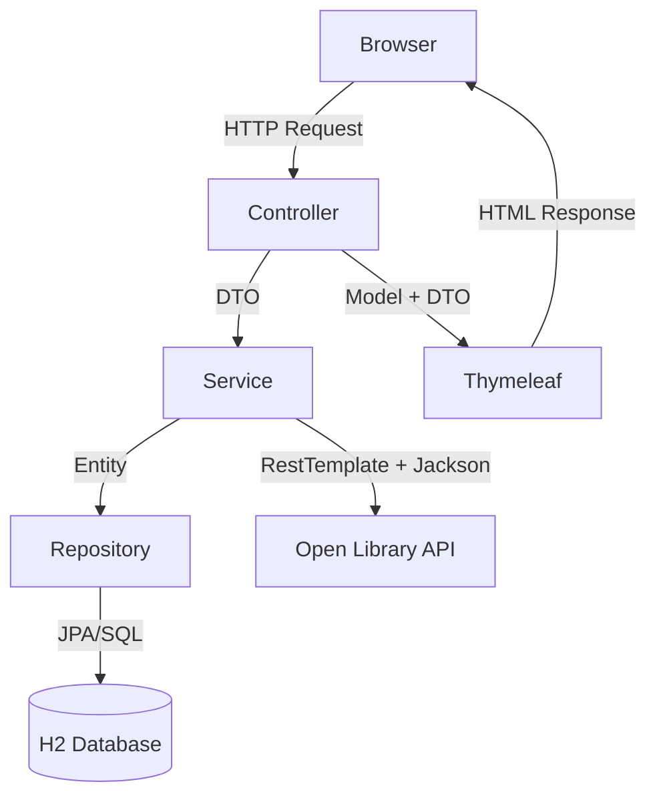
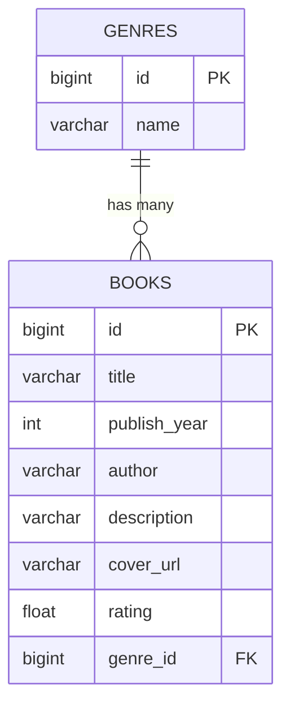

# Book Catalog — Лабораторна робота

> **Студент:** Levytskyi  
> **Група:** 121-22-3  
> **Дата:** 03.04.2026  

---

## 📋 Зміст

- [Мета роботи](#мета-роботи)
- [Технологічний стек](#технологічний-стек)
- [Архітектура](#архітектура)
- [База даних](#база-даних)
- [Функціонал](#функціонал)
- [Структура проєкту](#структура-проєкту)
- [Результати](#результати)
- [Висновки](#висновки)

---

## Мета роботи

Розробити повноцінний клієнт-серверний застосунок на Java, що реалізує **каталог книг** з підтримкою CRUD-операцій, фільтрації, пошуку та імпорту даних із зовнішнього API (**Open Library Search API**).

---

## Технологічний стек

| Компонент | Технологія |
|-----------|-----------|
| **Мова** | Java 17 |
| **Фреймворк** | Spring Boot 4.0.5 |
| **ORM** | Spring Data JPA / Hibernate 7.2.7 |
| **База даних** | H2 (in-memory) |
| **Шаблонізатор** | Thymeleaf + Bootstrap 5 |
| **Зовнішній API** | Open Library Search API (JSON) |
| **Парсинг JSON** | Jackson (`ObjectMapper`) |
| **HTTP клієнт** | `RestTemplate` |
| **Збірка** | Maven |
| **Допоміжні бібліотеки** | Lombok |

---

## Архітектура

Застосунок побудований за **багатошаровою архітектурою**:



### Шари застосунку

- **`controller`** — обробка HTTP-запитів (`@Controller`, `@RequestMapping`)
- **`service`** — бізнес-логіка, звернення до зовнішнього API
- **`repository`** — робота з базою даних через Spring Data JPA
- **`entity`** — JPA-сутності (`@Entity`, `@Table`)
- **`dto`** — об'єкти передачі даних між шарами
- **`mapper`** — конвертація між `Entity` ↔ `DTO`
- **`config`** — конфігурація бінів (`RestTemplate`, `ObjectMapper`)

---

## База даних

Реалізовано **дві пов'язані таблиці** зі зв'язком `One-to-Many`:



### Таблиця `genres`

| Поле | Тип | Опис |
|------|-----|------|
| `id` | `BIGINT` | Первинний ключ (auto increment) |
| `name` | `VARCHAR` | Назва жанру (унікальна) |

### Таблиця `books`

| Поле | Тип | Опис |
|------|-----|------|
| `id` | `BIGINT` | Первинний ключ (auto increment) |
| `title` | `VARCHAR` | Назва книги |
| `publish_year` | `INTEGER` | Рік видання |
| `author` | `VARCHAR` | Автор |
| `description` | `VARCHAR` | Короткий опис |
| `cover_url` | `VARCHAR` | Посилання на обкладинку |
| `rating` | `FLOAT` | Рейтинг (локальне поле) |
| `genre_id` | `BIGINT` | Зовнішній ключ → `genres.id` |

---

## Функціонал

### ✅ CRUD операції

Реалізовано повний набір операцій для сутності `Book`:

- **Create** — додавання нової книги через форму
- **Read** — перегляд списку книг
- **Update** — редагування даних книги
- **Delete** — видалення книги з підтвердженням

Для сутності `Genre` реалізовано:

- створення жанру
- перегляд списку жанрів
- видалення жанру

### 🔍 Пошук та фільтрація

В `BookRepository` реалізовано спеціальні методи:

```java
List<Book> findByTitleContainingIgnoreCase(String title);
List<Book> findByGenreId(Long genreId);
```

### 🌐 Імпорт із зовнішнього API (Open Library)

Сервіс звертається до `https://openlibrary.org/search.json` через `RestTemplate`, отримує JSON-відповідь і парсить її через `ObjectMapper`.

Імпорт заповнює:

- назву книги (`title`)
- автора (`author_name`)
- рік першої публікації (`first_publish_year`)
- URL обкладинки за `cover_i`

### 🎭 DTO патерн

Для передачі даних між шарами використовується `BookDto`, який містить поле `genreName` — це спрощує відображення списку книг у шаблонах без додаткової логіки у view.

---

## Структура проєкту

```text
src/
├── main/
│   ├── java/com/moviecatalog/_21223levytskyi/
│   │   ├── Application.java
│   │   ├── config/
│   │   │   └── AppConfig.java
│   │   ├── controller/
│   │   │   ├── BookController.java
│   │   │   └── GenreController.java
│   │   ├── dto/
│   │   │   ├── BookDto.java
│   │   │   └── GenreDto.java
│   │   ├── entity/
│   │   │   ├── Book.java
│   │   │   └── Genre.java
│   │   ├── mapper/
│   │   │   └── BookMapper.java
│   │   ├── repository/
│   │   │   ├── BookRepository.java
│   │   │   └── GenreRepository.java
│   │   └── service/
│   │       ├── BookService.java
│   │       └── GoogleBooksParserService.java
│   └── resources/
│       ├── application.properties
│       ├── data.sql
│       └── templates/
│           ├── books/
│           │   ├── list.html
│           │   ├── form.html
│           │   └── search.html
│           └── genres/
│               └── list.html
└── pom.xml
```

---

## Результати

### Каталог книг — `/books`

> Додайте скріншот сторінки списку книг.

### Форма додавання/редагування книги — `/books/new`

> Додайте скріншот форми книги.

### Імпорт із Open Library — `/books/search-openlibrary`

> Додайте скріншот сторінки імпорту.

### Управління жанрами — `/genres`

> Додайте скріншот сторінки жанрів.

### База даних H2 Console — `/h2-console`

> Додайте скріншот H2 Console.

---

## Висновки

В ході виконання лабораторної роботи було розроблено повноцінний клієнт-серверний застосунок на **Spring Boot** із реалізацією основних вимог:

- ✅ Багатошарова архітектура з використанням **DTO патерну**
- ✅ CRUD-операції для сутності `Book`
- ✅ Робота з пов'язаними сутностями `Genre` → `Book` (`One-to-Many`)
- ✅ Інтеграція із зовнішнім **JSON API (Open Library)** через `RestTemplate` та `Jackson`
- ✅ Серверна візуалізація на базі **Thymeleaf** + Bootstrap 5
- ✅ Зберігання даних у реляційній БД **H2** через **Spring Data JPA**
- ✅ Пошук за назвою та фільтрація за жанром через кастомні методи репозиторію
